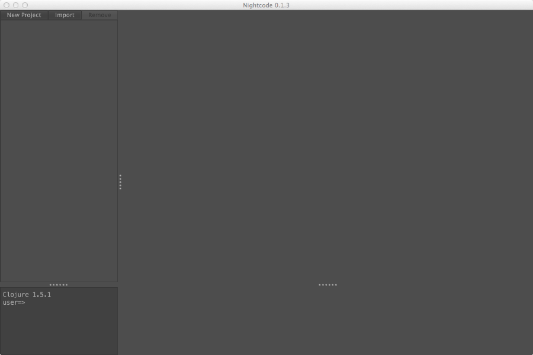
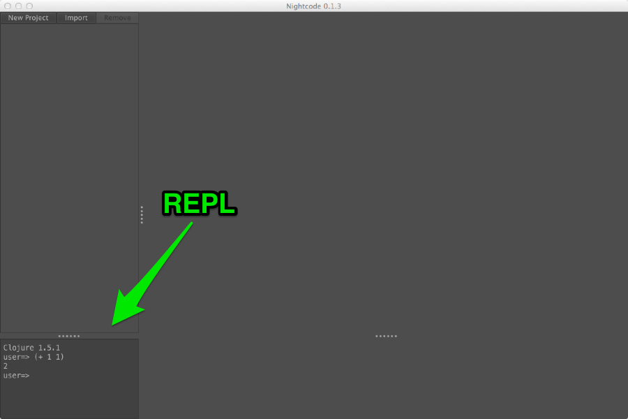
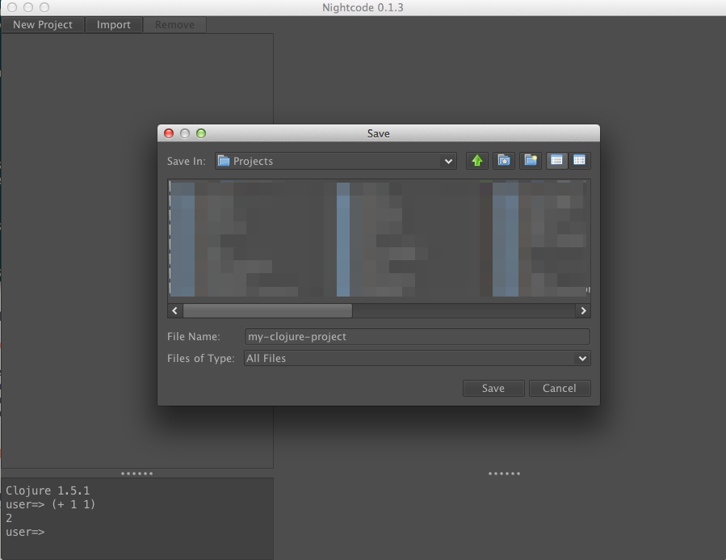
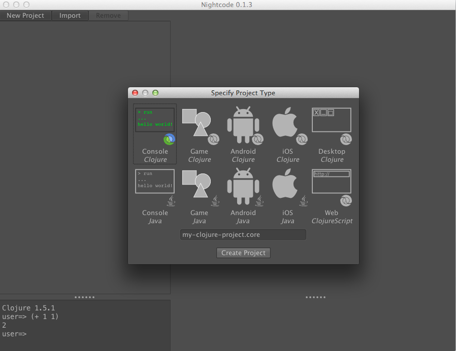
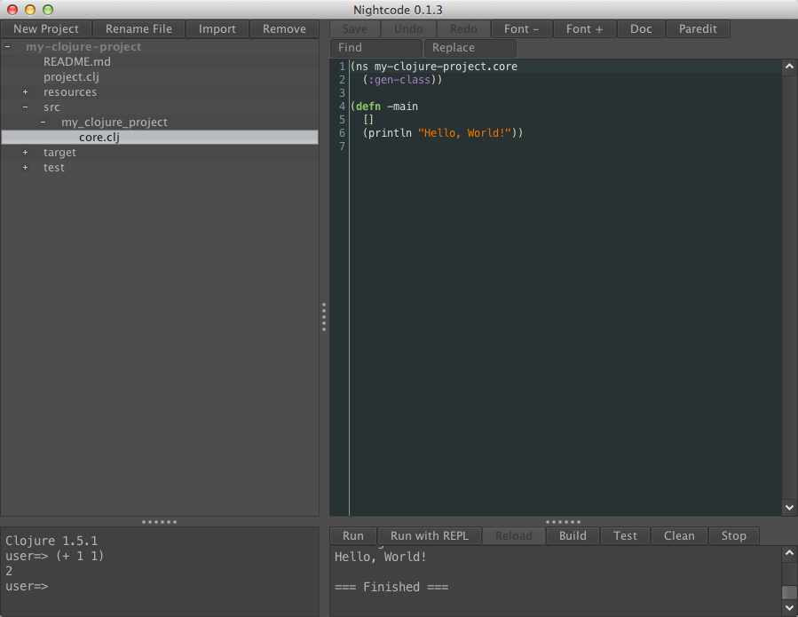
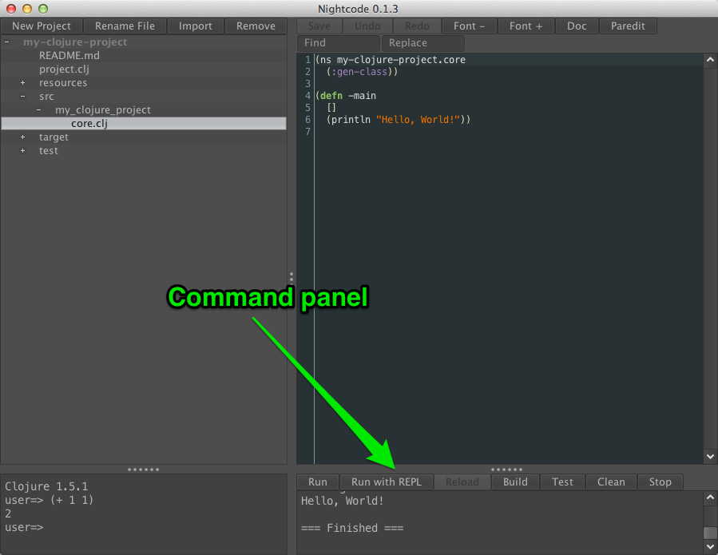

## Getting Started with Clojure using Nightcode

While using Clojure everyday is a blast, getting started with Clojure isn't always. Emacs and Vim are good choices for Clojure editors, but they aren't for everybody and they can be complicated to set up.

[Nightcode][] is an easy-to-use IDE for Clojure written by Zack Oakes. It bundles everything you need to use Clojure so you can get started quickly.

To use it, first go to the [Nightcode][] site and download the most current version. You will need Java installed: if you are using a Mac, you have it installed. If you are using Linux, you probably know how to install it, and if not, look at your distribution's documentation.

A file called `nightcode-x.y.z-standalone.jar` will be downloaded, where `x.y.z` is a version number. As of this article, it's version 0.1.3.

Go into your `Downloads` folder (or wherever you save files from your browser) and run the `nightcode-x.y.z-standalone.jar` file. If you are on a Mac or using a graphical file browser on any operating system, you should be able to double-click it. If not, open a terminal and run the following commands:

* `cd ~/Downloads/`
* `java -jar nightcode-*.jar`

After this, you should see a Nightcode window like the one below.

Look at the bottom left of the window where you should see the current version of Clojure and a prompt that says `user=>`. This area is called the **REPL**, which stands for "Read-Eval-Print-Loop," or in English, the place where you interact with Clojure. Click to the right of the prompt and enter (+ 1 1). If your window looks like the following, minus the arrows and green text, you are in business.

When you are ready to try making a Clojure project, click the "New Project" button at the top left. Use the file dialog box to navigate to where you want to create your project and type `my-clojure-project` into the text box beside "File Name," like in this screenshot.

After that, click the "Save" button and you will see another dialog. This one asks what type of project you want to create. As you can see, you have many options, including Java and ClojureScript projects, but for this first one, choose "Console - Clojure" and click "Create Project." Above the "Create Project" button is a text field for entering the Clojure namespace you want created for your project by default: leave that be for now.

Once you've done that, the left pane will change to show you a list of all the files in your project. Click the plus sign next to `src` and then the one that appears next to `my_clojure_project`. You should see `core.clj`, which you can click to see the contents of the file.

Right now, this file just has one function, `-main`, that will print out the text `Hello, World!`. We're not going to change this for now: that's something to do as you're learning Clojure, which you should be able to do now that you know how to start a project in Nightcode. Let's look at one more thing you need to know.

Look at the command panel, at the bottom right, highlighted in this screenshot.

In this panel, you'll see buttons for running your project, as well as "Run with REPL." Try "Run" first. You should see `Hello, World!` appear and then the text `=== Finished ===`, which is just there to let you know the program's done. Try "Run with REPL" next. It may take a few seconds to run after you click it. Some instruction text will scroll by, and then you'll see a prompt. Instead of saying `user=>` like the prompt in the left pane, this should say `my-clojure-project.core=>`. This indicates that any instructions you type in here will be executed within this namespace.

Lastly, go back up to `core.clj` and change what the `-main` function is going to print. You can put anything in between the quotes where `Hello, World!` is now. Click the "Save" button at the top of the page and then click again in the command panel. If you type `(-main)` and hit Return, you will notice your change did not take effect. In order to reload your code so you can see the changes, click "Reload" in the command panel. Once you've done that, you should be able to type `(-main)` again and see your changes.

Try out some of the other buttons on your own and see what they do. "Stop" will stop the REPL you've created, and "Test" should show you something interesting.

With that, you are ready to create new Clojure projects in Nightcode!  Good luck, and enjoy Clojuring!

[Nightcode]: https://sekao.net/nightcode/
